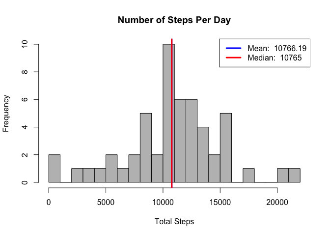
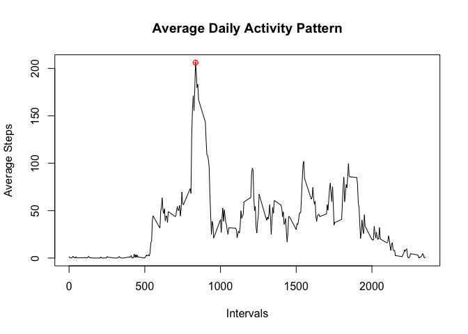
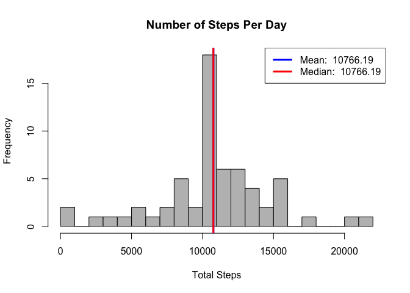
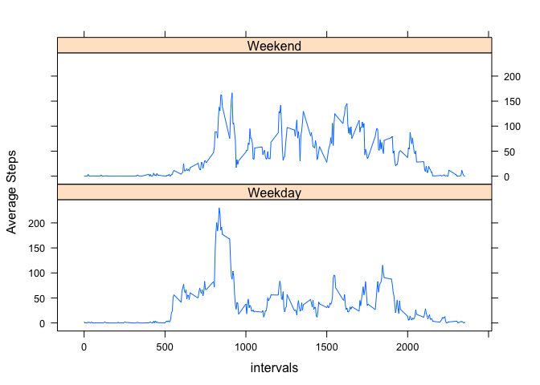

# Reproducible Research: Peer Assessment 1

*This document is the completed work for Peer Assignment #1 for Reproducible Research presented by Feng Li.*


## Loading and preprocessing the data


First step is always getting and cleaning the data. I read it into a dataframe, and save it to a new data frame after removing all NAs.

According to the assighment introduction, there are a total of 17,568 observations in this dataset, and the variables are as follows:

1. **steps**: Number of steps taking in a 5-minute interval (missing values are coded as NA)
2. **date**: The date on which the measurement was taken in YYYY-MM-DD format
3. **interval**: Identifier for the 5-minute interval in which measurement was taken


```r
# load the data
activity<- read.csv("activity.csv")
# remove NAs
actdata<- activity[complete.cases(activity$steps),]
head(actdata)
```

```
##     steps       date interval
## 289     0 2012-10-02        0
## 290     0 2012-10-02        5
## 291     0 2012-10-02       10
## 292     0 2012-10-02       15
## 293     0 2012-10-02       20
## 294     0 2012-10-02       25
```

```r
str(actdata)
```

```
## 'data.frame':	15264 obs. of  3 variables:
##  $ steps   : int  0 0 0 0 0 0 0 0 0 0 ...
##  $ date    : Factor w/ 61 levels "2012-10-01","2012-10-02",..: 2 2 2 2 2 2 2 2 2 2 ...
##  $ interval: int  0 5 10 15 20 25 30 35 40 45 ...
```


## What is mean total number of steps taken per day?


Next, I calculate the total number of steps taken per day, and make a histogtam to present the data.
I then calculate the mean and median of the total number of steps taken per day, and report them as vertical line on the graph.


```r
# tapply steps on each date, and calculate the sum of steps taken
daydata<- with(actdata, tapply(steps, date, sum, na.rm= TRUE))

# make a histogram of the steps taken per day
hist(daydata, col="grey", breaks=20, main="Number of Steps Per Day", xlab="Total Steps")

# calculate and report the mean and median
mn<- round(mean(daydata, na.rm=TRUE),2)
md<- round(median(daydata, na.rm=TRUE),2)
abline(v=mn,lwd=3,col="blue")
abline(v=md,lwd=3,col="red")
legend("topright", legend=c(paste("Mean: ", mn), paste("Median: ", md)),lwd=3, col=c("blue","red"))
```

 

We notice that the mean and median of the sum of daily steps are very close to each other. So the two vertical lines almost overlap on the histogram.


## What is the average daily activity pattern?


In this part, I visualize the average daily activity pattern. First I make a time series plot of the 5-minute interval and the average number of steps taken, averaged across all days.


```r
# calculate the number of steps taken in each interval averaged across all days
intvdata<- aggregate(actdata$steps, by = list(intervals= actdata$interval), mean)
head(intvdata)
```

```
##   intervals         x
## 1         0 1.7169811
## 2         5 0.3396226
## 3        10 0.1320755
## 4        15 0.1509434
## 5        20 0.0754717
## 6        25 2.0943396
```

```r
# Make a line plot of the data
plot(intvdata,type="l",main="Average Daily Activity Pattern",xlab="Intervals", ylab="Average Steps")

# find the interval containing the maximum number of steps and report it on the plot
maxstep<- intvdata[which.max(intvdata[,2]),]
print(paste("Maximum steps is", round(maxstep$x,2), "in interval",maxstep$intervals))
```

```
## [1] "Maximum steps is 206.17 in interval 835"
```

```r
points(maxstep, col="red", pch=10)
```

 

So, across all the days in the dataset on average, the 5-minute interval contains the maximum number of steps is the 835th interval, which means, at 8:35 am.


## Imputing missing values


As the assignment introduction puts it, the presence of missing days may introduce bias into some calculations or summaries of the data. Instead of being omitted, missing values will be filled in in this part. First of all, we'd like to know how many missing values in the dataset.


```r
# calculate the total number of missing values
sum(is.na(activity$steps))
```

```
## [1] 2304
```

As one of straightforward strategies, I will use the mean values of the corresponding 5-minute intervals to replace the NAs.


```r
# create a function that will return the second value if the first is NA
na_replace<- function(x,y){
      if(is.na(x)){
            return (y)
      }
      return (x)
}

# create a variable to hold average steps for each interval across all days, and save it to a new data frame
actdata2<- activity
actdata2$intvmn<- numeric(length=nrow(activity))
actdata2$intvmn[which(actdata2$interval==intvdata$intervals)]<- intvdata$x

# create another variable to hold new steps values whose NAs are filled in via the newly created function
actdata2$steps2<- numeric(length= nrow(activity))
actdata2$steps2<- mapply(na_replace,actdata2$steps,actdata2$intvmn)

# take a look at the new data frame without missing data
head(actdata2)
```

```
##   steps       date interval    intvmn    steps2
## 1    NA 2012-10-01        0 1.7169811 1.7169811
## 2    NA 2012-10-01        5 0.3396226 0.3396226
## 3    NA 2012-10-01       10 0.1320755 0.1320755
## 4    NA 2012-10-01       15 0.1509434 0.1509434
## 5    NA 2012-10-01       20 0.0754717 0.0754717
## 6    NA 2012-10-01       25 2.0943396 2.0943396
```


Using the data frame with missing values filled in, I calculate the total number of steps taken each day once again, as well as its mean and median value.


```r
daydata2<- with(actdata2, tapply(steps2, date, sum,na.rm= TRUE))
hist(daydata2, col="grey", breaks=20, main="Number of Steps Per Day", xlab="Total Steps")

mn2<- round(mean(daydata2, na.rm=TRUE),2)
md2<- round(median(daydata2, na.rm=TRUE),2)
abline(v=mn2,lwd=3,col="blue")
abline(v=md2,lwd=3,col="red")
legend("topright", legend=c(paste("Mean: ", mn2), paste("Median: ", md2)),lwd=3, col=c("blue","red"))
```

 

After filling in the missing values in the dataset, the mean of total number of steps taken per day does not change. And it makes sense that the median moves towards to the mean a little. So the median increased after this method of missing value replacement.


## Are there differences in activity patterns between weekdays and weekends?


The last part will visualise the potential differences in activity patterns between weekdays and weekends.


```r
# transform the class of date variable in the dataset into Date
week<- as.POSIXlt(actdata2$date, format = "%Y-%m-%d")$wday

# use ifelse loop to define "Weekend" and "Weekday", and transform it into factor variable.
actdata2$wktype<- as.factor(ifelse (week==0 | week==6, "Weekend", "Weekday"))
head(actdata2)
```

```
##   steps       date interval    intvmn    steps2  wktype
## 1    NA 2012-10-01        0 1.7169811 1.7169811 Weekday
## 2    NA 2012-10-01        5 0.3396226 0.3396226 Weekday
## 3    NA 2012-10-01       10 0.1320755 0.1320755 Weekday
## 4    NA 2012-10-01       15 0.1509434 0.1509434 Weekday
## 5    NA 2012-10-01       20 0.0754717 0.0754717 Weekday
## 6    NA 2012-10-01       25 2.0943396 2.0943396 Weekday
```

```r
# reorganize the average steps for each intervals based on weekday type
wkdata<- with(actdata2,aggregate(steps2,by=list(daytype=wktype,intervals=interval),mean))

# use lattice plotting system to make conditional panel plot.
library(lattice)
xyplot(x ~ intervals | daytype, data=wkdata, type="l", layout=c(1,2),ylab="Average Steps")
```

 

